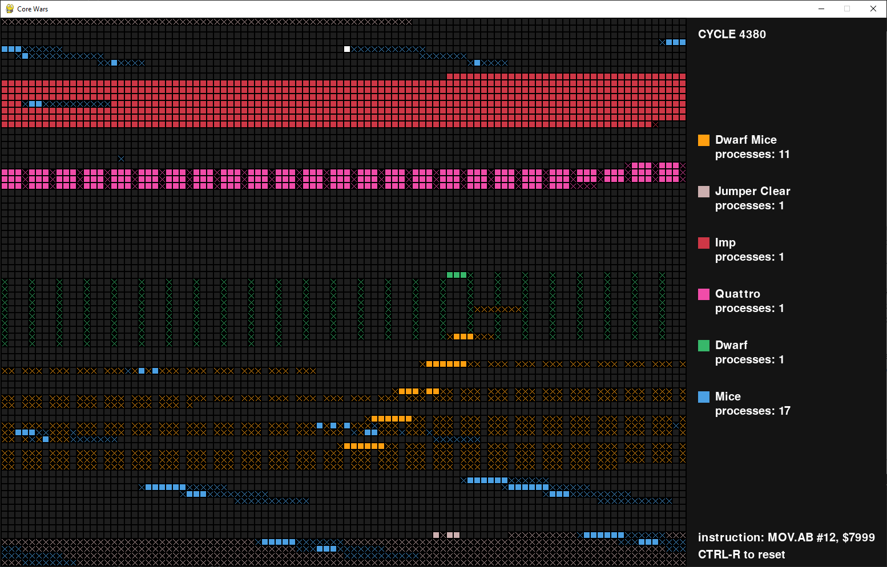

# Dokumentacja projektu z przedmiotu PIPR
### Core Wars - "wojny rdzeniowe"
### Autor: Piotr Brzeziński

## Wstęp
Celem niniejszego projektu było zaimplementowanie gry w tzw. Wojny Rdzeniowe - [Core Wars](https://pl.wikipedia.org/wiki/Core_War).

Istotą tej gry jest istnienie cyklicznego rdzenia - obszaru pamięci - na którym umieszczani są "wojownicy" - programy w języku Redcode (pseudo-assembler) wczytywane z pliku.

Co kolejkę wykonywana jest jedna instrukcja jednego wojownika, po czym w następnej instrukcja kolejnego i tak dalej. Pojedynczy wojownik może stworzyć podczas rozgrywki więcej niż jeden proces - wtedy instrukcje każdego z nich wykonywane są co kolejkę naprzemiennie. Dany proces uśmiercany jest w momencie, gdy wykona niedozwoloną operację - np. dzielenie przez zero - lub instrukcję typu `DAT` (jedną z wielu dostępnych w Redcode).

Redcode to język przypominający assemblera, ale dużo prostszy w swej istocie. Szeroki przewodnik na ten temat można znaleźć na stronie [The beginners' guide to Redcode](http://vyznev.net/corewar/guide.html).

W skrócie każda instrukcja języka składa się z:

- trzyznakowego symbolu instrukcji, np. `ADD`, `SPL`, `JMP`
- opcjonalnego modyfikatora oznaczonego kropką oraz jedną lub dwoma literami, np. `.AB`
- dwóch oddzielonych przecinkami operandów, z których każdy składa się z rodzaju adresacji (domyślnie `$`) oraz wartości, np. `1, }3`. Niektóre instrukcje wymagają tylko jednego operandu do poprawnego działania.

Możliwe jest też pozostawienie komentarza na końcu linijki, po znaku średnika.

Przykładowa instrukcja: `SEQ.i	}-1, $5`

Program, który uruchamia wczytanych wojowników i przeprowadza symulację ich walki nazywany jest **MARS** - **M**emory **A**rray **R**edcode **S**imulator.


## Implementacja
Główna część projektu (folder `corewars`) podzielona została na kilka plików:
- `redcode.py` - zawiera podstawowe klasy potrzebne do obsługi elementów języka Redcode - np. `OpCode` (typ instrukcji), `AddressingMode` (tryb adresacji operandu) czy `Warrior` - prostą klasę przechowująca instrukcje wojownika i jego nazwę
- `parser.py` - klasa `Parser`, zajmująca się przetwarzaniem otrzymanych linii z pliku na instrukcje języka Redcode i utworzeniem z nich kompletnego `Warrior`a.
- `core.py` - zawiera klasę `Core` (rdzeń), reprezentującą cykliczny obszar pamięci, w którym prowadzona jest symulacja, oraz klasy pomocnicze reprezentujące instrukcję oraz wojownika znajdującego się w rdzeniu.
- `mars.py` - klasa `MARS`, reprezentująca symulator, który korzystając z funkcjonalności wyżej opisanych elementów przeprowadza kolejka po kolejce bitwę pomiędzy przekazanymi mu wojownikami.

W folderze `tests` znajdują się również testy jednostkowe sprawdzające poprawność działania poszczególnych komponentów.

Wszystko 'spina` w całość kod zawarty w pliku `main.py`, zajmujący się uruchomieniem całej symulacji i wizualizujący rozgrywkę z pomocą biblioteki `pygame`.

### Opis interakcji między poszczególnymi komponentami:
W pierwszej kolejności do `MARS`a przekazywana jest zawartość wczytanych plików z kodem wojowników (`MARS.load_warriors()`). Każdy z nich przekazywany jest oddzielnie do `Parser`a (metoda `parse_warrior()`), który przetwarza je na listę instrukcji w oczekiwanym przez nas formacie (klasa `Instruction`).

Po otrzymaniu tak przetworzonych danych `MARS` wczytuje kod każdego wojownika do rdzenia (`Core.load_warrior()`), losując ich pozycje 'startowe' oraz dbając o odpowiednie odstępy. Na potrzeby wizualizacji do `MARS`a przekazać można też listę kolorów, którymi reprezentowani będą poszczególni wojownicy (przydział jest losowy - `MARS.assign_colors()`)

Po wykonaniu wszystkich czynności wstępnych symulację można uruchomić - pojedynczą kolejkę (cykl) wywołujemy za pomocą metody `MARS.cycle()` tak długo, jak w pamięci mamy 'żywych' wojowników. Na koniec każdej kolejki następuje zmiana aktywnego wojownika na następnego w kolejce - `Core.rotate_warrior()`. Jeśli obecnie aktywny wojownik podczas zmiany na następnego nie ma już żadnych procesów w swojej kolejce, zostaje usunięty z listy.

Kod zawarty w pliku `main.py` wykonuje symulację tak długo, aż w pamięci zostanie tylko 1 aktywny wojownik - wtedy wygrywa - lub osiągnięty zostanie limit cykli (domyślnie 80000) - wtedy nie można wskazać zwycięzcy.


## Uruchomienie programu
Aby poprawnie uruchomić program, potrzeba zainstalowanego interpretera języka Python w wersji `>= 3.7`. Należy również zainstalować bibliotekę `pygame`, np. z pomocą komendy `python3 -m pip install pygame`.

Po wykonaniu tych kroków możemy przejść do głównego folderu projektu i uruchomić plik `main.py`. Domyślnie w folderze `warriors` znajduje się 6 przykładowych wojowników. W celu np. wygodnego przełączenia między zestawami wojowników, jako parametr podać można nazwę folderu z którego chcemy wczytać pliki.

```
usage: main.py [-h] [--cycles [CYCLES]] [--warriors WARRIORS]

optional arguments:
  -h, --help            show this help message and exit
  --cycles [CYCLES], -c [CYCLES]
                        Max simulation cycles before round end
  --warriors WARRIORS   Name of the folder containing warrior files
```

### Przykładowy widok po uruchomieniu
